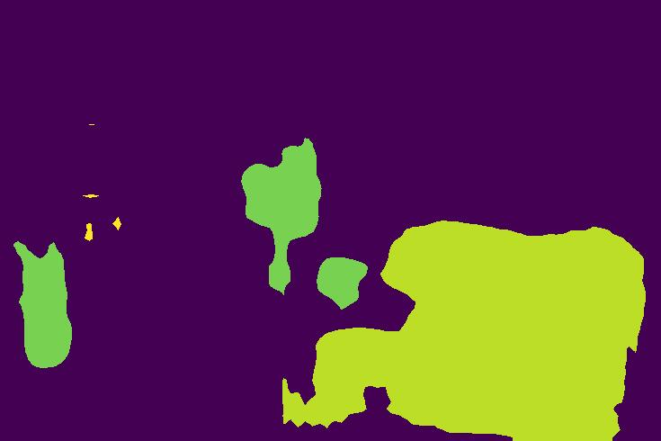

 # Semantic Segmentation with PyTorch and NumPy

This project generates semantic segmentation maps of images using PyTorch and NumPy. Semantic segmentation is the process of assigning a class label to each pixel in an image, thus dividing the image into regions of interest. This tool utilizes deep learning techniques implemented in PyTorch for efficient and accurate segmentation.

## Features

- **Semantic Segmentation**: Generate pixel-level segmentation maps for input images.
- **PyTorch Integration**: Leveraging the power of PyTorch for deep learning-based segmentation.
- **Efficient Processing**: Utilizes NumPy for efficient array manipulation and processing.

## Example Images

Below are some examples of original images and their respective segmentation maps generated by this tool:

### Original Image 1

### Original Image 2

### Original Image 3

### Original Image 4

### Original Image 5

